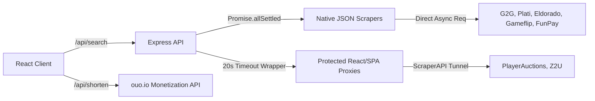
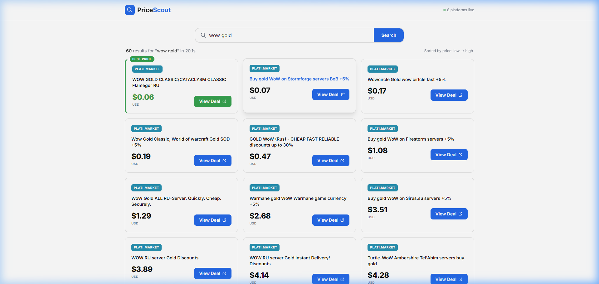
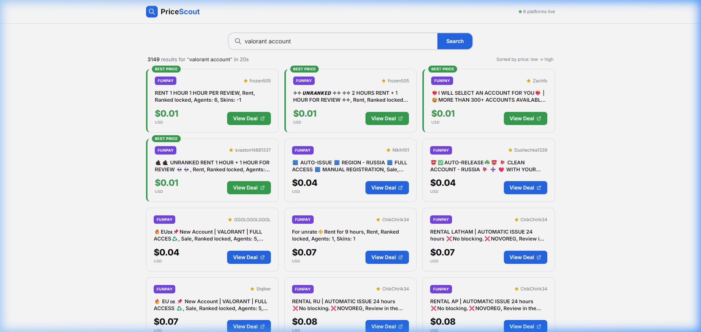

# PriceScout


A high-performance full-stack web application designed to be the ultimate price comparison engine for digital gaming goods (accounts, gold, items, and ranked boosting). PriceScout seamlessly aggregates real-time data across 7 leading grey-market marketplaces, presenting the cheapest offers dynamically.

## 🚀 Features

- **Hybrid Scraper Engine**: Intelligently mixes instantaneous, native JSON APIs with robust ScraperAPI reverse-proxies for heavily protected Cloudflare sites.
- **Microservice Resiliency**: Individual scrapers handle dynamic mappings and `Promise.allSettled()` ensures that one offline platform never crashes the query.
- **Smart Data Normalization**: Intelligently strips buzzwords and emojis from user queries (e.g., "valorant 🔥 accounts cheap" → "valorant account") before routing to specialized endpoints.
- **Background URL Monetization**: Automatically generates async ouo.io monetized links for deal routing without blocking frontend render speeds.
- **Dynamic "Best Price" Detection**: Real-time sorting and UI badging to automatically spotlight the absolute cheapest unified offer.

---

## 🏗️ System Architecture

PriceScout employs a dual-tier scraping mechanism to maintain extreme performance while ensuring deep platform reach:



### Supported Platforms
*   **G2G** _(Native JSON API Integration)_
*   **FunPay** _(Native HTML/Cheerio Extraction)_
*   **Plati.market** _(Native XML API Integration)_
*   **Eldorado.gg** _(Native JSON API Integration)_
*   **Gameflip** _(Native GraphQL/JSON Integration)_
*   **PlayerAuctions** _(ScraperAPI + Cloudflare Bypass)_
*   **Z2U** _(ScraperAPI + Dynamic Token Injection)_

---

## 📸 Action Shots

### Native JSON Aggregation ("wow gold")
Delivers thousands of results across natively queried platforms in under 3 seconds:


### Complex SPA Extraction ("valorant account")
Fetches 3,000+ distinct listings seamlessly merging static XML dumps with deep-rendered JavaScript single-page-application platforms:


---

## 🛠️ Tech Stack & Installation

**Frontend**: React (Vite) + TailwindCSS v4  
**Backend**: Node.js + Express + Cheerio + Axios

### Prerequisites
1. Node.js (v18+)
2. [ScraperAPI](https://www.scraperapi.com) Key (Free tier supported). Insert your API key in `server/utils/fetchHtml.js`.

### Running Locally

```bash
# 1. Clone the repository and install dependencies
npm run install-all # Or cd into client && npm i, then cd into server && npm i

# 2. Start the Backend API (runs on port 3001)
cd server
npm start

# 3. Start the React Frontend (runs on port 5173 with proxy configuration)
cd client
npm run dev
```

Visit `http://localhost:5173` to query the engine.

---

## 🧩 Modifying Scrapers
If you want to add or modify a scraper, implement the scraper dynamically returning the following standardized object shape to ensure the React UI renders properly:

```javascript
{
  platform: 'Platform Name',    // String
  title: 'Item Description',    // String
  price: 15.99,                 // Float (must be numeric for sorting)
  currency: 'USD',              // String (currently unified to USD)
  url: 'https://...',           // String (target redirect URI)
  seller_rating: '99%'          // String or Null (displays next to platform badge)
}
```
