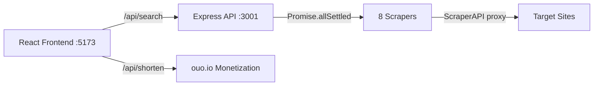

# LootReef — Build Walkthrough

## What Was Built

A full-stack price comparison web app for digital gaming goods across 8 grey-market marketplaces, built exactly per the CLAUDE.md spec.


---

## Architecture



---

## Files Created

### Backend (Node.js + Express)

| File | Purpose |
|------|---------|
| [fetchHtml.js](file:///c:/Users/GG%20FLIPPER/Desktop/Everything/LootReef/lootreefsite/server/utils/fetchHtml.js) | ScraperAPI wrapper with auto JS-render + premium flags |
| [parser.js](file:///c:/Users/GG%20FLIPPER/Desktop/Everything/LootReef/lootreefsite/server/utils/parser.js) | Query normalizer (strips emoji, buzzwords) |
| [g2g.js](file:///c:/Users/GG%20FLIPPER/Desktop/Everything/LootReef/lootreefsite/server/scrapers/g2g.js) | G2G scraper (JS-rendered) |
| [funpay.js](file:///c:/Users/GG%20FLIPPER/Desktop/Everything/LootReef/lootreefsite/server/scrapers/funpay.js) | FunPay scraper (server-rendered) |
| [eldorado.js](file:///c:/Users/GG%20FLIPPER/Desktop/Everything/LootReef/lootreefsite/server/scrapers/eldorado.js) | Eldorado.gg scraper (premium + JS) |
| [playerauctions.js](file:///c:/Users/GG%20FLIPPER/Desktop/Everything/LootReef/lootreefsite/server/scrapers/playerauctions.js) | PlayerAuctions scraper (premium + JS) |
| [z2u.js](file:///c:/Users/GG%20FLIPPER/Desktop/Everything/LootReef/lootreefsite/server/scrapers/z2u.js) | Z2U scraper (JS-rendered) |
| [gameflip.js](file:///c:/Users/GG%20FLIPPER/Desktop/Everything/LootReef/lootreefsite/server/scrapers/gameflip.js) | Gameflip scraper (JS-rendered) |
| [stewieshop.js](file:///c:/Users/GG%20FLIPPER/Desktop/Everything/LootReef/lootreefsite/server/scrapers/stewieshop.js) | StewieShop scraper (server-rendered SellAuth) |
| [plati.js](file:///c:/Users/GG%20FLIPPER/Desktop/Everything/LootReef/lootreefsite/server/scrapers/plati.js) | Plati.market scraper (server-rendered) |
| [scrapers/index.js](file:///c:/Users/GG%20FLIPPER/Desktop/Everything/LootReef/lootreefsite/server/scrapers/index.js) | Orchestrator — runs all 8 in parallel |
| [server/index.js](file:///c:/Users/GG%20FLIPPER/Desktop/Everything/LootReef/lootreefsite/server/index.js) | Express API (`/api/search`, `/api/shorten`) |

### Frontend (React + Tailwind CSS v4 + Vite)

| File | Purpose |
|------|---------|
| [App.jsx](file:///c:/Users/GG%20FLIPPER/Desktop/Everything/LootReef/lootreefsite/client/src/App.jsx) | Main app with hero → compact search transition |
| [SearchBar.jsx](file:///c:/Users/GG%20FLIPPER/Desktop/Everything/LootReef/lootreefsite/client/src/components/SearchBar.jsx) | Search input with loading spinner |
| [ResultCard.jsx](file:///c:/Users/GG%20FLIPPER/Desktop/Everything/LootReef/lootreefsite/client/src/components/ResultCard.jsx) | Result card with async ouo.io monetization |
| [ResultsGrid.jsx](file:///c:/Users/GG%20FLIPPER/Desktop/Everything/LootReef/lootreefsite/client/src/components/ResultsGrid.jsx) | Grid layout with skeleton loading & empty state |
| [index.css](file:///c:/Users/GG%20FLIPPER/Desktop/Everything/LootReef/lootreefsite/client/src/index.css) | Design system tokens, animations, platform badges |

---

## Key Design Decisions

- **Every scraper uses multi-selector fallback** — tries 6-8 CSS selectors per platform, stops at first that works
- **Embedded JSON fallback** — if HTML selectors fail, parses `__NEXT_DATA__` / `__INITIAL_STATE__` from `<script>` tags
- **No scraper can crash others** — each wrapped in try/catch returning `[]`, all run via `Promise.allSettled()`
- **Async monetization** — ouo.io link shortening runs in background per-card; shows card immediately, updates link when ready; falls back to direct link on 3s timeout
- **Cheapest result highlighted** — green left border + "Best Price" badge on the lowest-priced item

## How to Run

```bash
# Terminal 1: Start the backend API
node server/index.js        # → http://localhost:3001

# Terminal 2: Start the frontend
cd client && npm run dev     # → http://localhost:5173
```

> [!NOTE]
> Vite proxies `/api/*` requests to `localhost:3001` automatically in dev mode.

## Validated

- ✅ Backend starts on port 3001
- ✅ Frontend loads on port 5173
- ✅ Hero section, search bar, platform badges all render correctly
- ✅ No console errors
